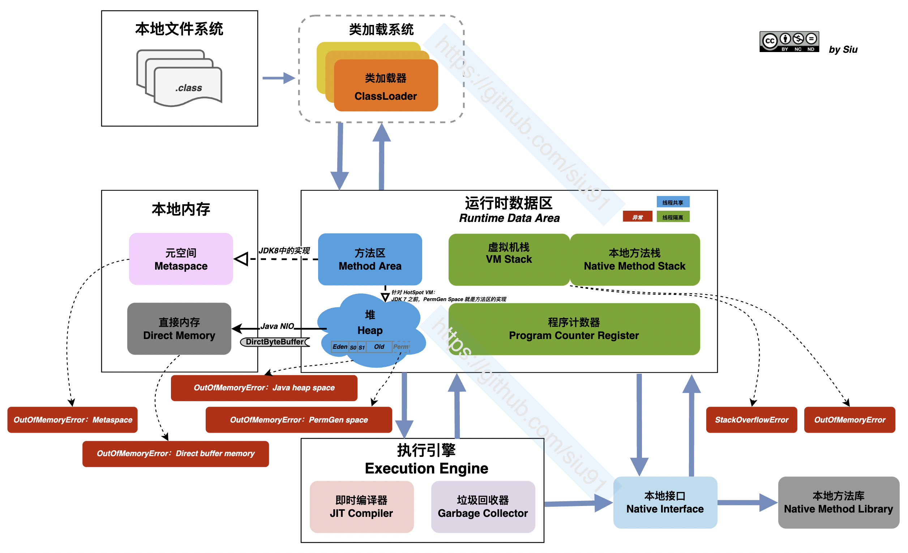

# 谈谈 Java 内存的管理

> By [Siu]() 2022/3/31

从 VM、GC 语言角度，JavaEr 很少会关注到内存的管理，但是所有程序的执行都避不开对内存使用的申请，以及回收；从现有主流的语言来看内存的管理大致会分为3类：

- 使用和分配都由用户去决定；C 就是一个代表
- 使用由用户来关注，回收交给 GC；典型如 Java，GO
- 由编译系统来管理：Rust 的所有权系统就是这样的一个强大的内存管理系统

C 选择了“相信”用户，Java 选择了”包容“用户，Rust 选择了“教育”用户。
孰优孰劣，不是今天的主题，还是回到 Java 内存的管理是怎样的？


## 栈和堆

栈和堆是编程语言中最基础的数据结构，栈和堆的的作用就是为程序提供运行时的内存空间。

**栈（Stack）**

栈是先入后出（FILO），可以类比为叠盘子，增加一个盘子**只能**从顶部（入栈），取下一个盘子**只能**从顶部（出栈）。

栈中的所有数据都必须占用已知且固定大小的内存空间。

**堆（Heap）**

与栈不同，对于大小未知或者可能变化的数据，我们需要将它存储在堆上。

当向堆上放入数据时，需要请求一定大小的内存空间。

**性能**

写入方面：入栈比在堆上分配内存要快，因为入栈时操作系统无需分配新的空间，只需要将新数据放入栈顶即可。相比之下，在堆上分配内存则需要更多的工作，这是因为操作系统必须首先找到一块足够存放数据的内存空间，接着做一些记录为下一次分配做准备。

读取方面：栈数据往往可以直接存储在 CPU 高速缓存中（高速缓存和内存的访问速度差异在 10 倍以上！），而堆数据只能存储在内存中。访问堆上的数据比访问栈上的数据慢，因为必须先访问栈再通过栈上的指针来访问内存。

因此，处理器处理和分配在栈上数据会比在堆上的数据更加高效。


## JVM 管理的内存

**JVM 规范定义**



>***注：***
>
>- 类加载系统：负责从文件系统或是从网络中加载class信息，加载的信息存放在一个称之为方法区的内存空间
>
>- 执行引擎：是jvm非常核心的组件，它负责执行jvm的字节码，一般先会编译成机器码后执行。
>
>- 垃圾收集系统：GC垃圾回收，保证我们程序能够有足够的内存空间运行，回收掉内存中已经无效的数据。回收算法一般有**标记清除**算法，**复制**算法，**标记整理**算法等。


### JVM 的内存结构


#### 方法区（Method Area）

方法区（Methed Area）用于存储已被虚拟机加载的类信息、常量、静态变量、即时编译后的代码等数据。

> 知识点：**方法区、永久代（PermGen space）、** **Metaspace（元空间）的区别**
>
> 方法区， 是 《JVM 规范》 定义的，所有虚拟机必须有的。
> 针对 HotSpot 虚拟机 ：
>
> - JDK7及之前， PermGen space 就是 方法区。
> - JDK8及之后， PermGen space 被移除， 换成 Metaspace（元空间），也是对**方法区**的新的实现。
>
> ```其实，移除永久代的工作从JDK1.7就开始了。JDK1.7中，存储在永久代的部分数据就已经转移到了Java Heap或者是 Native Heap。但永久代仍存在于JDK1.7中，并没完全移除，譬如符号引用(Symbols)转移到了native heap；字面量(interned strings)转移到了java heap；类的静态变量(class statics)转移到了java heap。```
>
> 元空间的本质和永久代类似，都是对JVM规范中方法区的实现。不过元空间与永久代最大的区别在于：元空间不在虚拟机设置的内存中，而是使用本地内存
>
> **永久代**
> **Java7及以前版本的Hotspot中方法区位于永久代中**。同时，永久代和堆是相互隔离的，但它们使用的物理内存是连续的。也有将方法去归于堆的，但称之为非堆。
>
> **元空间**
>
> 在Java8中，元空间(Metaspace)登上舞台，方法区存在于元空间(Metaspace)。同时，元空间不再与堆连续，而且是存在于本地内存（Native memory）。
>
> 元空间存在于本地内存，意味着只要本地内存足够，它不会出现像永久代中“java.lang.OutOfMemoryError: PermGen space”这种错误。
>
> Metaspace 区域位于堆外，所以它的最大内存大小取决于系统内存，而不是堆大小。
>
> 默认情况下元空间是可以无限使用本地内存的，但为了不让它如此膨胀，JVM同样提供了参数来限制它使用的使用。
>
> - -XX:MetaspaceSize，metadata的初始空间配额，以bytes为单位，达到该值就会触发垃圾收集进行类型卸载，同时GC会对该值进行调整：如果释放了大量的空间，就适当的降低该值；如果释放了很少的空间，那么在不超过MaxMetaspaceSize（如果设置了的话），适当的提高该值。
> - -XX：MaxMetaspaceSize，可以为metadata分配的最大空间。默认是没有限制的。

#### 堆（Heap）

Java堆（Java Heap）是Java虚拟机中内存最大的一块，是被所有线程共享的，在虚拟机启动时候创建，Java堆唯一的目的就是存放对象实例，几乎所有的对象实例都在这里分配内存。

这个区域被划分为年轻代和老年代的，我们经常接触的GC垃圾回收机制，就是主要回收堆空间的垃圾数据。
堆空间里的数据，是被所有线程所共享的，所以会存在线程安全问题，所以那些锁就是为了解决堆空间数线程安全问题而生的。

随着JIT编译器的发展和逃逸分析技术的逐渐成熟，栈上分配、标量替换优化的技术将会导致一些微妙的变化，所有的对象都分配在堆上渐渐变得不那么“绝对”了。

#### VM 栈

Java虚拟机栈（Java Virtual Machine Stacks）描述的是Java方法执行的内存模型。

每个方法在执行的同时都会创建一个线帧（Stack Frame）用于存储:

- 局部变量表

- 操作数栈

- 动态链接

- 方法出口等信息


每个方法从调用直至执行完成的过程，都对应着一个线帧在虚拟机栈中入栈到出栈的过程。

栈空间是每个线程独有的，互相直接不能访问。


>知识点：动态链接
>
>每一个栈帧内部都包含一个指向**运行时常量池**中该栈帧所属方法的引用，包含这个引用的目的就是为了支持当前方法的代码能够实现**动态链接（Dynamic Linking）**。比如：invokedynamic指令
>
>在Java源文件被编译到字节码文件时，所有的变量和方法引用都作为符号引用（Symbilic Reference）保存在class文件的常量池里。
>
>比如：描述一个方法调用了另外的其他方法时，就是通过常量池中指向方法的符号引用来表示的，**动态链接的作用就是为了将这些符号引用转换位调用方法的直接引用**。

#### 本地方法栈

本地方法栈（Native Method Stack）与虚拟机栈的作用是一样的，只不过 VM栈是服务Java方法的，而本地方法栈是为调用Native方法服务的（即JDK中用native修饰的方法）。

在Java虚拟机规范中对于本地方法栈没有特殊的要求，虚拟机可以自由的实现它，因此在Sun HotSpot虚拟机直接把本地方法栈和虚拟机栈合二为一了。


#### 程序计数器/寄存器

它是每个线程私有的空间，JVM会为每个线程创建单独的程序寄存器，在任意时刻，一个Java线程总是在执行一个方法，这个方法被称为当前方法，如果当前方法不是本地方法，程序寄存器会执行当前正在被执行的指令，如果是本地方法，则程序寄存器值为undefined，寄存器存放如当前环境指针、程序计数器、操作栈指针、计算的变量指针等信息。


程序计数器（Program Counter Register）是一块较小的内存空间，它可以看作是当前线程所执行的字节码的行号指示器。在虚拟机的概念模型里，字节码解析器的工作是通过改变这个计数器的值来选取下一条需要执行的字节码指令，分支、循环、跳转、异常处理、线程恢复等基础功能都需要依赖这个计数器来完成。

由于jvm的多线程是通过线程轮流切换并分配处理器执行时间的方式来实现的，也就是任何时刻，一个处理器（或者说一个内核）都只会执行一条线程中的指令。因此为了线程切换后能恢复到正确的执行位置，每个线程都有独立的程序计数器。


#### 直接内存

直接内存并不是虚拟机运行时数据区的一部分，也不是虚拟机规范中定义的内存区域，但这部分也是被频繁的读写使用，也可能会导致`OutOfMemoryError`异常的出现。

Java的 `NIO`中的`allocateDirect`方法是可以直接使用直接内存的，能显著的提高读写的速度。


## 从线程共享角度看内存区域


### 再看 Java 中的栈内存和堆内存


## 引用

## 字符串

## GC

## 逃逸分析

## 另一种实现：Netty 中的内存管理

## ref

[Java 虚拟机规范（英文）](https://docs.oracle.com/javase/specs/jls/se11/html/index.html)

[方法区、永久代、元空间辨析](https://zhuanlan.zhihu.com/p/346471261)

[JVM 的组成](https://juejin.cn/post/6844903815754285069)

[堆内存：年轻代、年老代、永久代](https://www.cnblogs.com/jichi/p/12580906.html)

[Java 8 内存模型：永久区、元空间](https://www.cnblogs.com/paddix/p/5309550.html)

[元空间和直接内存](https://blog.csdn.net/Ethan_199402/article/details/110431404)

[jverson.com/thinking-in-java/](https://jverson.com/thinking-in-java/jvm/jvm-components.html)

[栈帧中的动态链接作用是什么？](https://www.zhihu.com/question/48267791)

