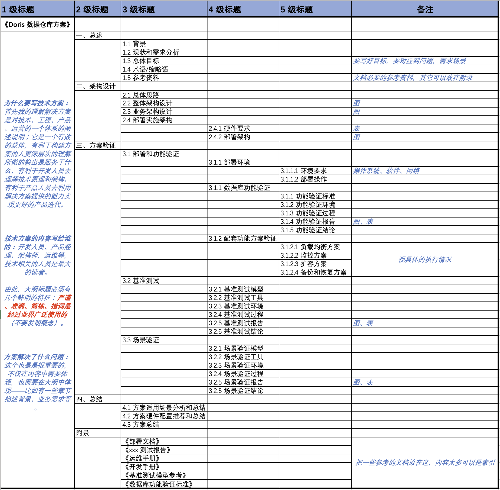

# 怎样写一个技术方案的大纲

> By [Siu]() 2022/3/28

## 前言

首先问题来源于工作上需要将最近做的一些 POC 整理成一个解决方案提供给应用平台。所以从以往的写作经验来看，首先需要能梳理出一个“大纲”，去合理规划整个解决方案的内容架构，同时这个大纲必须带上“技术”、“方案”这两个命题去思考总结。

## 要思考哪些问题

### 写给谁

给谁看，读者和受众是要放在第一位去思考的。

首先回答一下几个问题：

**为什么要写技术方案**：首先我的理解解决方案是对技术、工程、产品、运营的一个体系的阐述说明；它是一个有效的载体，有利于构建方案的人更深层次的理解所做的输出是服务于什么、有利于开发人员去理解技术原理和架构、有利于产品人员去利用解决方案提供的能力实现更好的产品迭代、有利于运营人员去做好系统的维护和升级。

**技术方案的内容写给谁的**：开发人员、产品经理、架构师，运维等，技术相关的人员是最大的读者。

由此，大纲标题必须有几个鲜明的特征：严谨、准确、简练、措词是经过业界广泛使用的（不要发明概念）。

**方案解决了什么问题**：这个也是是很重要的，不仅在内容中需要体现，也需要在大纲中体现——比如有一些章节描述背景、业务需求、目标等。

**`为什么要写 -〉写给谁看 -〉解决了什么问题`**，思考清楚再去考虑怎么写大纲的内容。

### 怎么写

写给谁，已经讨论完了，那怎么写？

还是要回到读者，读者最关心《技术方案》有哪些内容？

- 开发：怎么使用，怎么对接，API 接口？访问协议？架构原理？文档？。。。
- 产品：亮点，解决什么问题，哪些能有效提高产品的能力。。。
- 架构师：方案所用的技术架构是否合理，安全、稳定性、扩展。。。
- 运维：有没有友好 dashboard，Grafana 指标如何获取，故障备份，运维文档，自动化部署。。。
- ...

关注和收集“读者”的关注点，作为大纲内容的重要输入参考。

定义好“文章”的层次：技术方案是一个解决方案，会去完整的构建一个系统/框架。所以不能偏离中心——**`问题是什么&用了什么技术方案解决`**。

层次定义好能有效指导最终的大纲框架，相当是一个中心主题。

层次确定了，方案名就可以定下来了。

定义好”逻辑“：`开篇〉背景〉业务需求〉技术方案〉测试论证〉总结`；这是一个举例，重点在于需要需求考虑怎么串联整体的逻辑，每一部分有内在的逻辑，但也要有整体和上下的联系。

### Tips

还有哪些需要注意的：

- 不要忘了开篇和总结
- 大纲标题一定要仔细定义
- 可以高屋建瓴，但要注重实践（脚本、代码、测试数据放在合适的位置，索引或附录）

## 大纲的内容示例

## ref

[程序员该如何写一篇高质量的技术文章](https://jiamaoxiang.top/2021/05/04/%E7%A8%8B%E5%BA%8F%E5%91%98%E8%AF%A5%E5%A6%82%E4%BD%95%E5%86%99%E4%B8%80%E7%AF%87%E9%AB%98%E8%B4%A8%E9%87%8F%E7%9A%84%E6%8A%80%E6%9C%AF%E6%96%87%E7%AB%A0/)