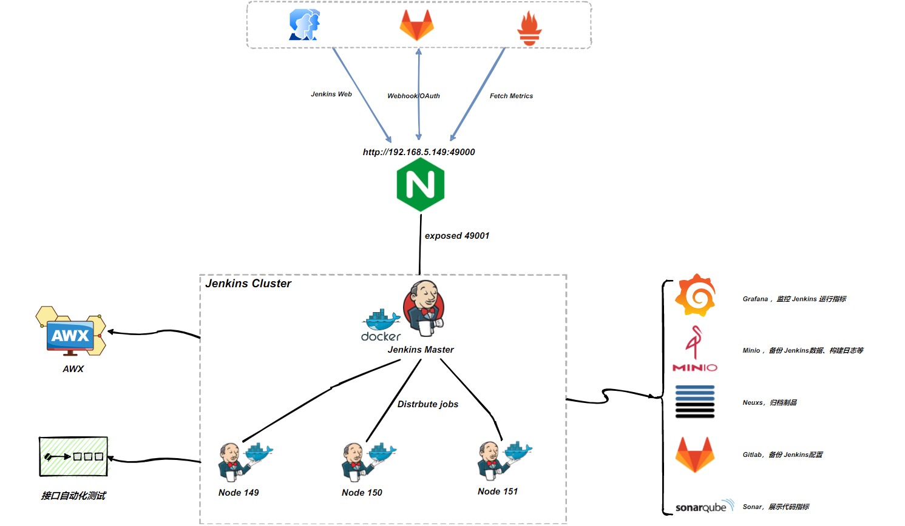

# [Jenkins Cluster](http://192.168.5.149:49000/)

&nbsp;&nbsp;&nbsp;&nbsp;&nbsp;&nbsp;&nbsp;&nbsp;`Jenkins` 作为 CI/CD 的执行引擎，构建一个可快速故障恢复、迁移，动态伸缩的 Jenkins 集群是设计阶段的主要目标。为此在设计之初，投入了大量时间调研、测试，最终选用 Docker 来动态构建我们的 Jenkins 集群：

- 服务可快速恢复：当 Jenkins Master 出现故障时，通过docker可快速恢；
- 构建环境稳定和一致：通过docker容器，保障每个流水线运行环境一致；

- 动态伸缩，合理使用资源：每次运行 Job 时，会创建一个 Jenkins Slave，Job 完成后，Slave 自动注销并删除容器，资源自动释放。

- 扩展性好：当资源严重不足而导致 Job 排队等待时，可以很容易调整slave的数量，从而实现扩展。

[参见: Docker 动态构建 Jenkins Slave](./pages/jenkins集群搭建/Docker动态构建Jenkins_Slave)

