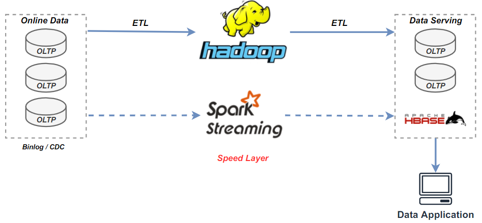
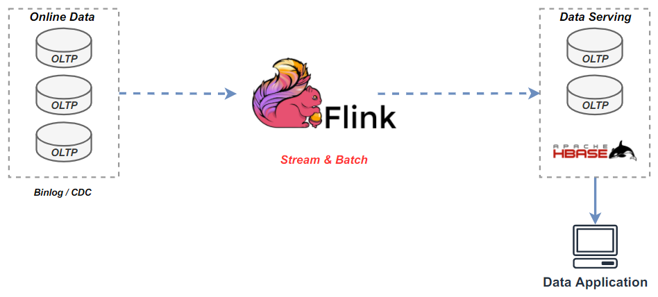
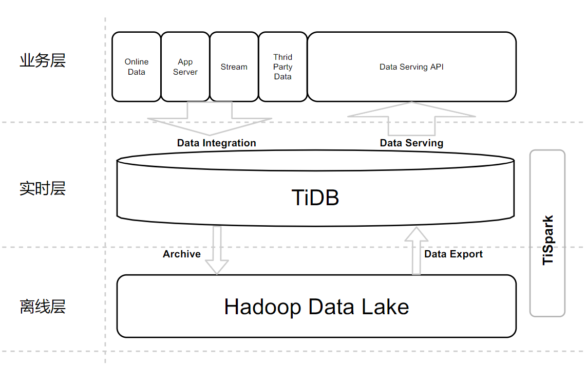

# 构建实时湖仓

>  ​	By [Siu]() 2021/7/24
>
>  ​		最近一直在思考由数据采集为起始，一直到数据治理、数据服务链路的数据湖解决方案，同时也看到了业界、社区的一些新的思路如 Hudi、 Icebreg、NewSQL，结合目前公司的的大数据架构、数据服务业务做一些更深入的分析和思考。

## 1 大数据，它解决了什么问题？

​		从数据管理技术的演进历程上看，从上世纪70年代第一个关系型数据库 System R 出现，到 80、90年代，涌现了大量商业关系型数据库，Oracle、IBM DB2、微软 SQL Server，以及现在比较流行的开源数据库 MySQL、PostgreSQL。

​		到了 2000 年初期，互联网时代到来，数据开始指数增长，**传统**关系型数据库无法存储、处理如此庞大的数据。2004 年，Google 的三大论文，GFS（分布文件存储）、MR（计算）、BigTable（数据架构），依此为指导 Hadoop 生态开始繁荣发展， 大家普遍认识到单一的数据库产品已经无法满足用户的需求，数据处理领域的技术方向开始分化：

- **OLTP** 领域依然被**传统关系型数据库**占据（SQL）

- **OLAP** 领域则成为了**大数据**技术的主战场（NOSQL）

​		2010s 早期，随着硬件的发展，内存、硬盘、带宽、网络延时等有了极大提升，数据库的架构迎来变革。
以 Google Spanner 代表的**分布式数据库**开始大规模投入生产。这时期 OLTP 和 OLAP 的概念逐渐开始模糊，HTAP 的概念应运而生，将 OLTP 和 OLAP 混合在一起，在同一个数据库上处理这两种负载，回到了数据库产品的初衷，**NewSQL** 时代即将到来。

​		现在我们再来看下这个问题”**大数据，它解决了什么问题？**“

- 传统数据库可以**有限的**解决 OLTP 和 OLAP 负载，但当数据庞大时，AP 问题无法解决
- 大数据**致力且擅长**解决数据规模庞大的 OLAP 场景，特别是 Hadoop 的数仓架构逐渐成为主流（现在看，可称为**传统数仓架构**）

这里我们关注到两个要点：

- **1、数仓 **

- **2、NewSQL(HTAP)**

  

  *下面先看下传统数仓架构的演进。*

## 2 传统数仓架构的演进

​		数据仓库的概念早在上世纪90年代就已经被提出，但随着Hadoop生态的流行，数仓开始有了实际且有力的载体。下面用几个简单的架构表达各个阶段的演进。

### 2.1 离线数仓（T+1）

***`图 2-1，数仓架构-离线数仓`***

### 2.2 Lambda 实时数仓(T+nm)

***`图 2-2，数仓架构-lambda实时数仓`***

### 2.3 Kappa 实时数仓(T+0)

***`图 2-3，数仓架构-kappa实时数仓`***

**数据实时性**，一直都是数仓架构演进的重要目标，也是用户的重要需求。

## 3 数仓架构的关注点

***`图 3-1，数仓架构的关注点`***

## 4 当前架构

>  在传统数仓构建演进的过程中，业界一直在围绕两大主要目标：
>
>  - 数据实时性
>  - 海量数据处理能力

### 4.1 当前架构

***`图 4-1，大数据架构`***

### 4.2 当前架构解决的问题

***`表 4-1，大数据组件解决问题`***

| 组件      | 解决的问题                                                   | 备注                                   | 归类         |
| --------- | ------------------------------------------------------------ | -------------------------------------- | ------------ |
| HDFS      | 分布式文件存储                                               |                                        | 存储         |
| MapReduce | 批处理计算                                                   |                                        | 计算         |
| Hive      | 类SQL 的计算（MR）                                           |                                        | 计算         |
| Hbase     | BigTable 的开源实现，提供快速随机访问的数据的能力            | 依赖 MR 的计算能力，依托 HDFS 作为存储 | 存储、数据库 |
| Kudu      | HDFS<-Kudu->Hbase，拥有一些OLAP和OLTP的特性，低延迟随机访问、逐行插入、更新和快速分析，中间层、集市层 | 依赖 Spark 、Impala 计算               | 存储，数据库 |
| Spark     | 处理数据（kudu），Spark Streaming 实时处理                   |                                        | 计算         |
| Impala    | 交互式查询，解决hive的查询时延问题（目前用于公司的查询检索产品），MPP 计算分析 | 采用 HDFS 和 HBase 存储数据            | 计算，MPP    |
| ES        | 对外服务接口                                                 |                                        | 计算、存储   |

### 4.3 当前架构存在的问题

- 目前并未演进到 lambda、kappa 架构，数据延时高

- 数仓分层经过 ETL 逻辑复杂，一份数据存储于多种介质，存储、时间成本过高

- 数据链路长

- 技术栈复杂

- 数据开发技术成本大：尤其是数据开发工程师、数据分析工程师

## 5 我们需要解决的几大问题

我们要解决的几大问题：

1、业务在线层：

- 数据汇聚：在线业务的数据CDC或批量采集同步（医院的交易型系统数据）、海量存储、高并发写、行更新
- 数据服务：OLTP、海量存储（PB）

2、离线数仓层（数据湖）：海量存储（10PB+）、计算（批处理）

3、实时数仓层：OLAP、MPP、海量存储（PB）、计算（流处理）

下面我们看下，上文关注的第二个重点 **NewSQL(HTAP)** 会给数仓建设带来什么样的解决思路。

## 6 NewSQL 的实时数仓架构

### 6.1 MySQL 作为数仓有什么问题？

> ​		上面提到传统数据库具备**有限的**解决 OLTP 和 OLAP 的负载，但并没有深入讨论，传统关系型数据库的不足；这里假设一下用 MySQL 作为我们的数据仓库架构核心会面临哪些问题（ODS、DWD、DWS、ADS）。

- 无法满足海量数据的存储（ODS、DWD、DWS）
- 无法满足海量数据的分析需求（DWD、DWS）
- 无法满足**大规模并行计算**的需求（ODS、DWD）
- 无法满足**横向扩展**的需求（ODS、DWD、DWS）

### 6.2 TiDB 能力对比

> ​		**TiDB** 是一个开源的 NewSQL 数据库，支持混合交易和分析处理 （HTAP） 工作负载。它兼容 MySQL，可水平扩展、具有强一致性、分布式和高可用性的特点。

***`表 6-1，TiDB 能力对比`***

| 能力                         | 现有方案            | TiDB                 |
| ---------------------------- | ------------------- | -------------------- |
| 随机访问的数据库（二级索引） | 是，hbase + phoenix | 是                   |
| 随机访问、更新               | 是，kudu            | 是                   |
| 海量存储                     | 是，hdfs            | 是 + hdfs            |
| MPP 能力                     | 是，impala          | 是，Tiflash          |
| 交互查询                     | 是，impala          | 是                   |
| 类 sql 查询                  | 是，impala、hive    | 是                   |
| 批处理计算能力               | 是，MR、Spark       | 是，TiSpark          |
| 数据应用层点查能力           | 是，ES + hbase      | 是                   |
| 通用的数据访问协议           | 否                  | 是，兼容 MySQL 5.7   |
| 高级数据库的权限模型         | 否                  | 是，mysql 的权限模型 |
| 标准SQL 查询能力             | 否                  | 是，SQL              |
| 实时数仓                     | 否，未来可演进      | 是                   |
| AP、TP 负载隔离              | 否                  | 是，TiFlash          |

### 6.3 NewSQL 产品对比

> 待补充，StarRocks 为不同的产品类型。

***`表 6-2，NewSQL 产品横向对比`***

|                     | [cockroachdb](https://github.com/cockroachdb/cockroach)      | [OceanBase](https://github.com/oceanbase/oceanbase)          | [TiDB](https://github.com/pingcap/tidb)                      | StarRocks（略）                                              |
| ------------------- | ------------------------------------------------------------ | ------------------------------------------------------------ | ------------------------------------------------------------ | ------------------------------------------------------------ |
| 类型                | 分布式/NewSQL/HTAP                                           | 分布式/NewSQL/HTAP                                           | 分布式/NewSQL/HTAP                                           | 分布式/MPP                                                   |
| 定位                | The most highly evolved database on the planet. Born in the Cloud. Architected to Scale and Survive. | 分布式关系数据库                                             | 实时 HTAP 数据库                                             | 极速MPP数据库                                                |
| 开源                | 2014，MIT Star 21.1k Contributions 512                 | 2021，MulanPubL-2.0 Star 3.3k Contributions 70         | 2014，Apache License 2.0 Star 29.1k  Contributions 626 | 2021，Elastic License 2.0 Star 1.2k Contributions 35   |
| 文档                | [英文](CockroachDB Docs)                                     | [中文](https://www.oceanbase.com/docs/oceanbase-database/oceanbase-database/V3.1.2/features) | [中/英文](https://docs.pingcap.com/zh/tidb/stable)           | https://docs.starrocks.com/zh-cn/main/introduction/StarRocks_intro |
| 数据量级            | PB                                                           | PB，单表万亿，1500 节点                                      | PB，单表千亿，500 节点                                       | 10PB                                                         |
| ACID                | 是                                                           | 是                                                           | 是                                                           | 部分                                                         |
| SQL                 | 兼容 postgresql                                              | 兼容 mysql 5.6，兼容 oracle（企业版）                        | 兼容 mysql 5.7                                               | 兼容 mysql                                                   |
| 安全                | RBAC；LDAP                                                   | RBAC                                                         | RBAC，表级                                                   | RBAC，表级；LDAP                                             |
| 多租户              |                                                              | 是，资源隔离                                                 |                                                              |                                                              |
| 分布式事务          | 乐观事务模型                                                 |                                                              | 乐观事务模型                                                 |                                                              |
| KV存储引擎          | RocksDB                                                      |                                                              | RocksDB                                                      |                                                              |
| 数据一致性/共识算法 | Raft                                                         | Paxos                                                        | Raft                                                         | Paxos                                                        |
| 部署                |                                                              |                                                              | tiup                                                         | 企业版有部署管理工具                                         |
| 监控                |                                                              |                                                              | tidb dashboard,grafana                                       |                                                              |
| 数据迁移            |                                                              |                                                              |                                                              |                                                              |
| 总结                |                                                              |                                                              | AP 在 Tiflash 加持下会比 oceanbase 性能好，                  |                                                              |

- TP：ob>tidb/cr>sr
- AP：sr>tidb>ob/cr
- 开源和生态：tidb>cr/sr/ob

### 6.4 TiDB  的应用场景

> ​		TiDB 的应用案例很多，有很多互联网、金融行业的成功实践案例：
>
> 丰巢、美团、北京银行、光大银行、中国平安、小红书，360、陆金所、中通、58、汽车之家、中国电信、国家电网

- 替换 Mysql 作为 TP库，带来 AP 能力，交易分析一体化

  - [丰巢]([[精选实践]TiDB 在丰巢核心支付平台百亿级数据的深度实践 - 技术文章 / 用户实践 - AskTUG](https://asktug.com/t/topic/1570))：核心支付系统，百亿规模数据
  - [美团]([客户案例 | PingCAP](https://pingcap.com/cases-cn/user-case-meituandianping))：数百个 TiDB 集群，1700 多个物理节点。单集群最大 40 多个节点，单表记录最大上**千亿**条；
  - 中国银行：支撑域、监控系统
  - [光大银行]([客户案例 | PingCAP](https://pingcap.com/cases-cn/user-case-china-everbright-bank))：理财业务、2000万笔/小时、5000万笔/日，40TB
  - 北京银行：支付清算平台、银联无卡快捷支付平台、金融服务互联平台、网贷业务平台核心金融业务场景
  - 中国平安、陆金所

- 实时数仓方案

  - 浙商银行：实时数仓、数据量等未知
  - [小红书]([客户案例 | PingCAP](https://pingcap.com/cases-cn/user-case-xiaohongshu-2))：实时数据服务，数据产生的速率峰值 QPS 达到三四万，单表一天写入 5 亿左右的数据
  - [中通]([客户案例 | PingCAP](https://pingcap.com/cases-cn/user-case-zto-express)):双十一大促中，TiDB 同时支撑线上 OLTP 和 OLAP 的业务， QPS 峰值在 12 万+，支持百亿级的插入和更新。

- 作为组件的替代方案

  - hbase 用 TiKV
  - MPP 场景应用

  

### 6.5  构建数据湖和实时数仓

#### 6.5.1 总体架构

***`图 6-1，整体架构`***

​		用户的数据可以通过各种各样的方式写进 TiDB，在 TiDB 里面在进行一些 ETL 之类的操作然后写入到离线计算中，最后再将结果反馈到 TiDB。TiDB 可以直接对外提供实时数据分析的服务，这也是非常流行的架构之一。

#### 6.5.2 技术架构

***`图 6-2，技术架构`***

- 四个场景
  - 数据汇聚
    - CDC
    - 批流一体（Flink SQL + UDF），入湖入仓
    - 异构数据海量存储
    - ~~治理系统数据、标化系统维表数据~~
    - ~~hive metadata（调度监控、资源监控的场景）~~
  - 数据服务
    - 接口点查
    - ~~事务型交易~~
    - 数据导入/导出
  - 数据分析
    - 数仓多维分析、关联分析（MPP/TiFlash）
    - 湖仓数据关联分析（TiSpark/Spark）
    - Ad-hoc ，大数据交互查询（Trino+Iceberg，MPP/TiFlash）
    - 跨源级联查询（Trino）
  - 数据共享交换
    - 湖仓数据交换（TiSpark/Spark）
    - ~~跨域的数据交换（ADS，TiBinlog）~~
    - ~~跨域的数据发布/订阅（ADS，TiCDC+MQ+多租户）~~
- 三层架构
  - 业务层
    - CDC + MQ + 批流一体（Flink SQL/UDF），实时处理入湖入仓
    - 标准服务接入方式 SQL/JDBC，可负载交易系统
    - 提供数据服务、数据分析、数据共享交换标准的接口/服务
  - 实时数仓
    - 分析和点查（HTAP）
    - HTAP 负载隔离，按需扩展
    - PB 级数据负载能力
    - 数据权限/访问控制（RBAC）
  - 数据湖
    - 统一存储、异构海量存储（结构/半结构/非结构化数据）
    - ~~具备湖仓一体的能力~~
- 主要技术栈：
  - 存储：HDFS、TiKV/TiFlash(RocksDB)
  - 计算：Flink、Spark、MR/Tez
    - SQL/MPP 引擎：Trino
  - 其它：
    - iceberg（表格式）、Ranger（权限）、ShardingSphere（脱敏加密）
- 降本方案
  - ~~AIT（all-in-tidb，or in NewSQL）~~
  - ~~AISR （all-in-starrocks）~~

#### 6.5.3 业务架构（待更新）

***`图 6-3，业务架构`***

#### 6.5.4 收益

| 序号 | 收益                                                         |
| ---- | ------------------------------------------------------------ |
| 1    | **数据实时性高**                                             |
| 2    | 技术栈统一，可扩展性强                                       |
| 3    | 数据业务线清晰：     - 数据开发：采集（CDC）、实时处理（Flink）、批处理（Spark）     - 数仓建设：围绕 TiDB 构建数据服务     - 数据分析： MPP 引擎、TiSpark/Spark 构建分析能力 |
| 4    | 数据内治理：统一的数据仓库，hive meta+治理交易数据/标化维表数据，一定程度达到”数据内治理“ 		- 库、表、字段元信息 	    - 表：表行数、表大小、行平均大小、创建时间、更新时间 |
| 5    | 数据安全 	- 数仓：[数据权限控制（RBAC，库、表）](https://docs.pingcap.com/zh/tidb/dev/security-compatibility-with-mysql) 	- 数仓：数据脱敏、数据加密（中间件提供支持）     - ~~数据湖：iceberg +ranger~~ |
| 6    | 开发体验： 	- 数据访问方式 SQL，Mysql 协议 	- 基于 SQL 数据分析  	- 丰富的 SQL Client |
| 7    | 节约成本：覆盖大部分场景，OLTP（100%）、OLAP（>80%）；节约存储、计算、带宽 |
| 8    | 运维和管理：   -  Ambari    -  扩容工具 TiUP   -  备份与恢复工具 BR   -  监控：TiDB Dashboard 集群关键指标：SQL 分析/慢日志，实例、主机、Region 监控等 |

### 6.5 POC 计划

> 待补充

#### 6.5.1 整体目标

- 数据实时：10 mins
- 数据仓库：分层统一存储，提供大部分数据服务能力（现有100%，未来80% 场景）
- 数据内治理：满足基础元数据治理的需求（数据仓库）
- 数据安全
  - 数据仓库中实现基于角色的权限控制（库、表）
  - 数据仓库中实现数据脱敏、加密（透明中间件）
- 数据湖：海量存储数据（结构化、半结构化、非结构化）和数仓模型类数据、离线分析、湖仓数据交换

问题：

- 批量写的性能问题是否存在？如果存在如何规避
- 大字段的存储限制（6M-120M）
- ~~宽表限制：默认为 1017，最大可调至 4096~~
- ~~技术的掌握能力~~

## REF

- Kudu

  - kudu现在拥有一些OLAP和OLTP的特性，但是缺少对跨行的原子性、一致性、隔离性、持久性事务的支持
  - **kudu仅仅是一个存储层，因此它并不处理数据，而是依赖于外部的处理引擎比如Imapala、Spark等来处理。kudu把数据按照自己的列存储格式存储在底层的Linux文件系统，不像HBase那样，Kudu不以任何方式使用HDFS。**

- [Impala vs. TiDB Comparison (db-engines.com)](https://db-engines.com/en/system/Impala%3BTiDB)

- Impala 大数据生态的MPP

- TiDB

  - 真正意义上的 HTAP 数据库；

  - 互相隔离的 OLAP 和 OLTP 负载；

  - 分析友好，强实时性、强一致性的列存；

- DW数据分层，由下到上为DWD，DWB，DWS。

  - DWD：data warehouse details 细节数据层，是业务层与数据仓库的隔离层。主要对ODS数据层做一些

    数据清洗和规范化

    的操作。

    - 数据清洗：去除空值、脏数据、超过极限范围的

  - DWB：data warehouse base 数据基础层，存储的是客观数据，一般用作中间层，可以认为是大量指标的数据层。

  - DWS：data warehouse service 数据服务层，基于DWB上的基础数据，整合汇总成分析某一个主题域的服务数据层，一般是宽表。用于提供后续的业务查询，OLAP分析，数据分发等。

    - 用户行为，轻度聚合
    - 主要对ODS/DWD层数据做一些轻度的汇总。
    
  - ADS： application data store ，数据应用层

- [当 TiDB 与 Flink 相结合：高效、易用的实时数仓 | PingCAP](https://pingcap.com/blog-cn/when-tidb-and-flink-are-combined)

- [BR 备份与恢复场景示例 | PingCAP Docs](https://docs.pingcap.com/zh/tidb/stable/backup-and-restore-use-cases)

- [Dumpling 使用文档 | PingCAP Docs](https://docs.pingcap.com/zh/tidb/stable/dumpling-overview)

- [TiDB 高并发写入场景最佳实践 | PingCAP Docs](https://docs.pingcap.com/zh/tidb/stable/high-concurrency-best-practices)

- [TiDB TPC-H 50G 性能测试报告 | PingCAP Docs](https://docs.pingcap.com/zh/tidb/stable/benchmark-tpch)

- [迈向企业级核心场景的 TiDB 5.0 | PingCAP](https://pingcap.com/blog-cn/tidb-5.0-ga-is-now)

- [成为一栈式数据服务生态： TiDB 5.0 HTAP 架构设计与场景解析（混合负载） | PingCAP](https://pingcap.com/blog-cn/tidb-5.0-htap-architecture-design-and-become-scenario-analysis)

- [TiDB 企业级解决方案 ：实时数仓解决方案| PingCAP](https://pingcap.com/solution-detail/tidb-realtime-warehouse-solution)

- [再谈 SQL 引擎 | ZRJ](https://zrj.me/archives/1969)

- [TiDB 配置文件描述：列大小配置 6M-120M| PingCAP Docs](https://docs.pingcap.com/zh/tidb/stable/tidb-configuration-file#txn-entry-size-limit-从-v50-版本开始引入)

- [解析 TiDB 在线数据同步工具 Syncer | PingCAP](https://pingcap.com/blog-cn/tidb-syncer)

- [数据脱敏 :: ShardingSphere (apache.org)](https://shardingsphere.apache.org/document/legacy/4.x/document/cn/features/orchestration/encrypt/)

- [TiDB Lightning 简介：全量数据高速导入到 TiDB 集群 | PingCAP Docs](https://docs.pingcap.com/zh/tidb/stable/tidb-lightning-overview)

- [【精选实践】TiDB 在丰巢核心支付平台百亿级数据的深度实践 - 技术文章 / 用户实践 - AskTUG](https://asktug.com/t/topic/1570)

- [客户案例 | PingCAP](https://pingcap.com/case/)

- [基于Flink+Iceberg构建企业级实时数据湖_johnhuster的专栏-CSDN博客](https://blog.csdn.net/john1337/article/details/118887581)

- [汽车之家：基于 Flink + Iceberg 的湖仓一体架构实践_Ververica的博客-CSDN博客](https://blog.csdn.net/weixin_44904816/article/details/117677783)

- [亚马逊云科技：我们的智能湖仓是架构，而非产品，更非湖仓一体 (qq.com)](https://mp.weixin.qq.com/s/WCygv5L--w8I-ibbeiU-Rw)

- [物化视图 | Apache Doris](http://doris.apache.org/master/zh-CN/administrator-guide/materialized_view.html)

- [Table/Partition evolution - Apache Iceberg](https://iceberg.apache.org/evolution/)

- [zeppelin在云音乐的实践 - 知乎 (zhihu.com)](https://zhuanlan.zhihu.com/p/298125721)

- [TiDB 2020 Hackathon - D - TiGraph - Google 幻灯片](https://docs.google.com/presentation/d/1RBe8HUtGqzlyruEyCbzKh8dxOk6D7Zd5dSz1mPXvPoc/edit#slide=id.gb53c29cf3a_0_56)

- [PD的时钟服务——TSO - 技术文章 / 原理解读 - AskTUG](https://asktug.com/t/topic/2026)

- [iPotato | PD 授时服务 TSO 设计简析](https://ipotato.me/article/67)

- [TiSpark 用户指南 | PingCAP Docs](https://docs.pingcap.com/zh/tidb/stable/tispark-overview)

- [滴滴大数据安全权限实践-InfoQ](https://www.infoq.cn/article/yfxkhjdask0eme2gaqnz)

- [集群间双向同步 | PingCAP Docs](https://docs.pingcap.com/zh/tidb/stable/bidirectional-replication-between-tidb-clusters#集群间双向同步)

- [TiCDC 运维操作及任务管理 :sink-uri 配置 pulsar| PingCAP Docs](https://docs.pingcap.com/zh/tidb/stable/manage-ticdc#sink-uri-配置-pulsar)

- [support pulsar's sink. by cocotyty · Pull Request #751 · pingcap/ticdc (github.com)](https://github.com/pingcap/ticdc/pull/751/files)

- [OceanBase开源版与TiDB对比测试报告 - 墨天轮 (modb.pro)](https://www.modb.pro/db/70554)

**本页编辑**      **[@gongshiwen](http://192.168.1.23/gongshiwen)**  