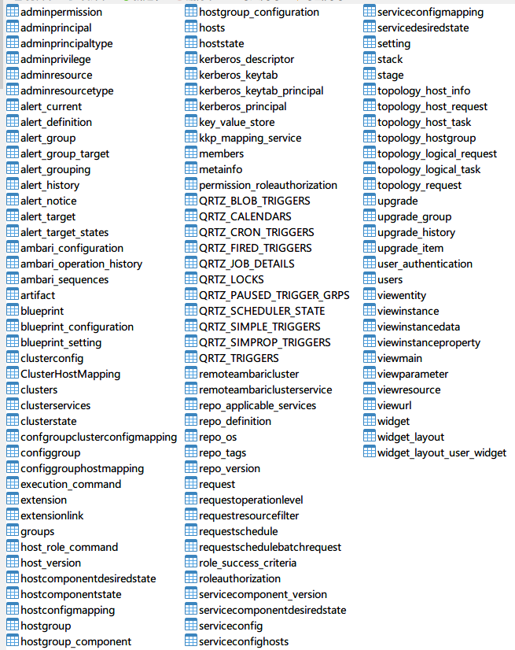
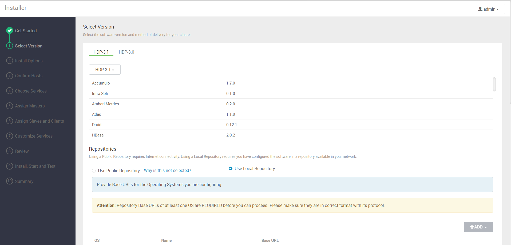

# Ambari 安装


## 1 准备

- CentOS 7 yum 源
  - 或已安装 httpd、yum-plugin-priorities、yum-utils
- 离线包 [ambari-2.7.5.0-centos7.tar.gz]( https://pan.baidu.com/s/1sNIbtHYrfI0e1MeXWd9cjQ)
- 安装 MySQL/MariaDB/兼容Mysql 的数据库
- 安装 JDK 1.8.0_191
- MySQL 驱动包 [mysql-connector-java-5.1.44.jar](/var/lib/ambari-server/resources)
  - 放在 `/var/lib/ambari-server/resources` 目录下


## 2 配置

### 2.1 配置 ambari 数据库

#### 创建数据库 ambari

> Hostname : 192.168.6.152
> Database name : ambari
> Username : ambari
> Enter Database Password: admin123
>
> 以上在安装 Ambari 时是输入的配置项

```sql
create database ambari default character set='utf8';

CREATE USER 'ambari'@'localhost' IDENTIFIED BY 'admin123';

CREATE USER 'ambari'@'192.168.6.152' IDENTIFIED BY 'admin123';

CREATE USER 'ambari'@'%' IDENTIFIED BY 'admin123';

GRANT ALL PRIVILEGES ON ambari.* TO 'ambari'@'localhost' IDENTIFIED BY 'admin123' with grant option;  

GRANT ALL PRIVILEGES ON ambari.* TO 'ambari'@'192.168.6.152' IDENTIFIED BY 'admin123' with grant option;  

GRANT ALL PRIVILEGES ON ambari.* TO 'ambari'@'%' IDENTIFIED BY 'admin123' with grant option;

FLUSH PRIVILEGES;

SELECT * FROM mysql.`user` WHERE `User`='ambari';
```


#### 初始化 ambari 数据库

> 执行 config/Ambari-DDL-MySQL-CREATE.sql 文件





### 2.2 配置 Ambari 本地仓库

#### 安装 yum 工具

```shell
yum install yum-utils createrepo
yum install yum-plugin-priorities -y
```

#### 创建 HTTP 服务

```shell
yum -y install httpd
/sbin/chkconfig httpd on
/sbin/service httpd start
```

在浏览器里访问安装 HTTP 服务的主机，查看是否成功。如： [http://192.168.6.152:80](http://192.168.100.30:88/)

#### 上传 Ambari 安装包

> 上传安装包，解压到 `/var/www/html/`

```shell
tar -zxvf ambari-2.7.5.0-centos7.tar.gz -C /var/www/html/
```

#### 配置本地 yum 源

```shell
vim /etc/yum.repos.d/ambari.repo

#VERSION_NUMBER=2.7.5.0-72

[ambari-2.7.5.0]

#json.url = http://public-repo-1.hortonworks.com/HDP/hdp_urlinfo.json

name=ambari Version - ambari-2.7.5.0

baseurl=http://192.168.6.152/ambari/centos7/2.7.5.0-72/

gpgcheck=1

gpgkey=http://192.168.6.152/ambari/centos7/2.7.5.0-72/RPM-GPG-KEY/RPM-GPG-KEY-Jenkins

enabled=1

priority=1
```


## 3 安装

> 注：最终的配置文件保存在 `/etc/ambari-server/conf`

```shell
[root@xxx ~]# ambari-server setup
Using python  /usr/bin/python
Setup ambari-server
Checking SELinux...
SELinux status is 'enabled'
SELinux mode is 'permissive'
WARNING: SELinux is set to 'permissive' mode and temporarily disabled.
OK to continue [y/n] (y)? y
Customize user account for ambari-server daemon [y/n] (n)? y
Enter user account for ambari-server daemon (root):ambari
Adjusting ambari-server permissions and ownership...
Checking firewall status...
Checking JDK...
[1] Oracle JDK 1.8 + Java Cryptography Extension (JCE) Policy Files 8
[2] Custom JDK
==============================================================================
Enter choice (1): 2
WARNING: JDK must be installed on all hosts and JAVA_HOME must be valid on all hosts.
WARNING: JCE Policy files are required for configuring Kerberos security. If you plan to use Kerberos,please make sure JCE Unlimited Strength Jurisdiction Policy Files are valid on all hosts.
Path to JAVA_HOME: /usr/local/jdk1.8.0_191
Validating JDK on Ambari Server...done.
Check JDK version for Ambari Server...
JDK version found: 8
Minimum JDK version is 8 for Ambari. Skipping to setup different JDK for Ambari Server.
Checking GPL software agreement...
GPL License for LZO: https://www.gnu.org/licenses/old-licenses/gpl-2.0.en.html
Enable Ambari Server to download and install GPL Licensed LZO packages [y/n] (n)? y
Completing setup...
Configuring database...
Enter advanced database configuration [y/n] (n)? y
Configuring database...
==============================================================================
Choose one of the following options:
[1] - PostgreSQL (Embedded)
[2] - Oracle
[3] - MySQL / MariaDB
[4] - PostgreSQL
[5] - Microsoft SQL Server (Tech Preview)
[6] - SQL Anywhere
[7] - BDB
==============================================================================
Enter choice (1): 3
Hostname (localhost): 192.168.6.152
Port (3306): 4000
Database name (ambari):ambari
Username (ambari): ambari
Enter Database Password (bigdata):
Re-enter password:
Configuring ambari database...
Enter full path to custom jdbc driver: /var/lib/ambari-server/resources/mysql-connector-java-5.1.44.jar
Copying /opt/mysql-connector-java-5.1.44.jar to /usr/share/java
Configuring remote database connection properties...
WARNING: Before starting Ambari Server, you must run the following DDL directly from the database shell to create the schema: /var/lib/ambari-server/resources/Ambari-DDL-MySQL-CREATE.sql
Proceed with configuring remote database connection properties [y/n] (y)? y
Extracting system views...
ambari-admin-2.7.5.0.72.jar
....
Ambari repo file contains latest json url http://public-repo-1.hortonworks.com/HDP/hdp_urlinfo.json, updating stacks repoinfos with it...
Adjusting ambari-server permissions and ownership...
Ambari Server 'setup' completed successfully.
```


**依次输入：**

- y
- y
- ambari
- 2
- /usr/local/jdk1.8.0_191  （JAVA_HOME）
- y
- y
- 3
- 192.168.6.152 （数据库主机IP）
- 4000 （数据库端口）
- ambari （数据库名）
- ambari  （数据库用户名）
- admin123 （数据库密码）
- admin123 （数据库密码）
- /var/lib/ambari-server/resources/mysql-connector-java-5.1.44.jar   （数据库驱动）
- y


## 4 启动

```shell
#启动
ambari-server start

#查看状态
ambari-server status

#停止
ambari-server stop

# 查看日志
more /var/log/ambari-server/ambari-server.log
```


启动成功后，访问：[http://IP:8080](http://IP:8080/)，默认用户名/密码是 ： admin/admin

